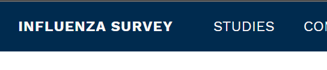
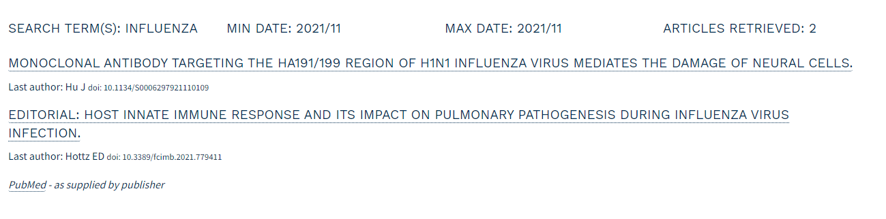

# Influenza

This website is created by [Helmholtz HZI](https://www.helmholtz-hzi.de/en) to support the open collaboration of researchers around Influenza.

## Get help

For any issues with the site including typos or rendering issues, please file an [issue](https://github.com/INSERTREPO/issues) or send a pull request. The site automatically deploys once pull requests are merged.

## Contributing content

To contribute content, you can create a Pull Request with the content.

1. Fork the repository (repo) of the serohub website.
1. Draft your post in R Markdown or Markdown.
1. (Optional) Preview and refine your post locally.
1. Submit via pull request and preview your post.
1. A SeroHub maintainer accepts your content, or requests changes.

An excellent place to learn about contributing science related blog posts is [ropensci technical guidelines](https://blogguide.ropensci.org/technical.html).

### Information about the website

This website was built using [Hugo](https://gohugo.io/).

Hugo is a website generator that pre-generates web pages so that they can be hosted very cheaply. It is used by a significant amount of the research and science communities due to its excellent support for markdown which enables researchers to use literate programming techniques in R and Python to interleave analysis and text.

This documentation assumes no prior knowledge with Hugo and will get you up and running with using it on your system.
For content editing you will only need to concern yourself with four pages from the Hugo site:

[Installing Hugo](https://gohugo.io/getting-started/installing)

We recommend taking the package manager approach if speed and ease-of-install is your priority.

[Hugo Webserver](https://gohugo.io/commands/hugo_server/)

For running a local version of the website so you can edit content in a controlled manner before pushing it up to the remote repository.

[Hugo Front Matter](https://gohugo.io/content-management/front-matter#readout)

Front Matter in Hugo is metadata (data about your data) embedded within a content file. We can edit front matter values to specify, for example, a title and a publication date for a page.

[Hugo Shortcodes](https://gohugo.io/content-management/shortcodes/)

Shortcodes are small snippets of HTML that can be added into a markdown content file. Hugo renders the shortcode using a predefined template. This website includes a sample content page which includes a custom shortcode created to fetch articles from the [PubMed](https://pubmed.ncbi.nlm.nih.gov/) API. You'll be shown how to cutomise and reuse the shortcode for other content pages.

When you are working on content for the site, you will be working almost exclusively with markdown files (.md). [Markdown is easy to learn](https://www.markdownguide.org/) and very well supported. **Just remember, if there is content you want to change on the body of a page, there's a markdown file for it**. There are some changes on the site you will need to make outside of markdown, which is discussed in the following section.

## Making changes to the website

For changes to the website, there are a few key areas:

- The [config](config.toml) file that supports changing many values used in the repository. Many of the values that you want to change are available either here or in .toml files found in [the i18n folder](/i18n).

For example, to change the value of the site name on the top left corner:



You would refer to the [title value in config.toml](https://github.com/hzi-braunschweig/influenza.net/blob/5502fa87bb4a632b9f55ce0eba04c7694c3391ec/config.toml#L15). Use the search function in your IDE/Code editor to speed up the process of finding the value you'd like to change. The variable names are descriptive.

- [index.html](layouts/index.html) determines what the home page looks like. It may reference files in syntax like `{{ partial "leaflet.html" . }}` -- these are sub-templates and are found in [layouts/partials](layouts/partials)
- [baseof.html](layouts/_default/baseof.html) describes header and footer content used across the site. This is where you would change things like JavaScript files, the nav bar, and the footer
- [share_study.md](content/share_study.md) contains the html used to generate the contact form that will submit the contents to netlify. Note the Netlify free tier has an upload limit of 10Mb per month. This is _not_ a long-term solution.
- [hzi.css](assets/hzi.css) is the custom style sheet for the website. Use this to tweak or override the website appearance.

## Add a researcher

If you would like to add a researcher, the general content steps are taken but instead of generating files with markdown you amend the [Researcher list](data/researchers.csv).

### Publications

The default site (en):

- The folder `content/publication` contains the reference to scientific papers. **It's our main folder to curate publications!**
- Each `.md` refers to one scientific paper, and is named by its DOI, e.g. `10.1101-2020.05.18.20103283.md`
- The markdown files are organized by the publisher, e.g. `content/publication/biorxiv/10.1101-2020.05.18.20103283.md`

The language-specific sites (e.g. de):

- The majority of scientific papers are written in English language.
- In `config.toml` each language (except `en`) has an additional content folder defined, e.g. `contentDir="content_de"` for the German site.
- In order to display English papers, we will copy/mirror whole folders to the language-specific directory, e.g. `cp content/publication/biorxiv content_de/publication/biorxiv`

## The fetchapi shortcode

This is a custom shortcode to draw in articles from the PubMed database. You can specify which articles you'd like by entering your search term(s), a date range, and the number of articles to retrieve -- although you should be careful not to retrieve too many at once as it will make too many requests to the API.

This is a sample shortcode with the necessary parameters specified:

```go

```

Generating this output:


Remember that you simply place this shortcode within the markdown of whatever page you wish to add it to.

For search term, all special characters must be URL encoded. Spaces may be replaced by '+' signs.

Articles retrieved is the total number of articles from the PubMed input set to be retrieved, up to a maximum of 10,000

The two parameters (mindate, maxdate) must be used together to specify an arbitrary date range. The general date format is YYYY/MM/DD, and these variants are also allowed: YYYY, YYYY/MM.

You can find more information on using this API over on the [PubMed documentation](https://www.ncbi.nlm.nih.gov/books/NBK25499/).

## Getting things set up locally

### Get the repo locally

1. If you're a member of the organisation, `git clone --recurse-submodules git@github.com:hzi-braunschweig/influenza.net.git`
2. If you're not a member of the organisation, fork the repo, then
   - `git clone --recurse-submodules git@github.com:<your account>/influenza.net.git`
   - `git remote add upstream https://github.com/hzi-braunschweig/influenza.net.git`

### Get the submodule

We use a theme [hugo-infinite](https://github.com/lambdafu/hugo-finite) as the basis for the site. The `--recurse-submodules` argument in `git clone` will have established a connection. _You should not make changes to contents in the submodule_ instead, you should copy files from the themes structure and paste them into the corresponding section of the main repository and edit it there. You only work with the submodule contents directly if you want to fix a bug and that is best done with a fresh fork of the theme directly from the theme's repository.

### Run hugo locally

From inside the website directory, run `hugo serve` to get a live local copy (typically on <http://localhost:1313>) that will update whenever you make changes.

## Infrastructure

### GitHub

We will host the solution on Netlify with the source files hosted on GitHub. This will
enable HZI researchers to work in an open way and accept collaborations from others.

### Hugo

This website uses [Hugo](https://gohugo.io). To work with Hugo locally, you will need to [install it](https://gohugo.io/getting-started/quick-start/).

#### Debugging Hugo

If you are opening a local Hugo server for content editing you will only likely receive spacing and indentation errors within [toml](https://github.com/toml-lang/toml)/[yaml](https://docs.ansible.com/ansible/latest/reference_appendices/YAMLSyntax.html). Double check that you have enclosed your value in speech marks and closed it properly.

If you are venturing further into Hugo and making templating changes, the [template debugging page](https://gohugo.io/templates/template-debugging/) and the [Hugo Discourse](https://discourse.gohugo.io/) are great resources.

"Studies" and "Publications" use custom [section page templates](https://gohugo.io/templates/section-templates/), the rest use the default list and single templates.

"Contribute", "About" and "Test" are all [menu items](https://gohugo.io/content-management/menus/). From the front matter you can see that they are added to the top nav via [Hugo's menu system](https://gohugo.io/content-management/menus/#readout).

### Netlify

The website is hosted on [Netlify](https://netlify.com).

The CMS works using a principle called [Open Authoring](https://www.netlifycms.org/docs/open-authoring/). You can see this configured in the CMS configuration [here](https://github.com/hzi-braunschweig/influenzahub.net/blob/0903702fb23c7ba675ae74bd91f02430c49212c8/static/admin/config.yml#L5).

#### Automated deployments

The website is automatically updated everytime there is a change to the master branch in GitHub. Additionally, any pull requests or branches will also have preview URLs built. The preview links for Pull Requests will be included in the Pull Request interface on GitHub.

#### Authentication

The Netlify hosting has Visitor access > OAuth authentication enabled with a [GitHub OAuth application](https://developer.github.com/apps/building-oauth-apps/) - this is important for the Netlify CMS to support open authoring.

Below are the steps to configure authentication:

#### Enable OAuth for a Netlify Site

There are two steps to enable OAuth for the Netlify site.

1. [Register a new OAuth application with GitHub](#register-a-new-application)
2. [Configure credentials in Netlify](#netlify-credentials-settings)

#### Register a new application.

1. In Github, click here to access [developer settings for OAuth Apps](https://github.com/settings/developers).

2. For the **Authorization callback URL**, enter `https://api.netlify.com/auth/done`. Populate the other fields appropriately.

3. On your new application's GitHub overview page, make note of the **Client ID**.

4. Generate a **Client Secret** and make note of it for later. **_You can't access this secret again_**.

#### Netlify Credentials settings

When you complete application registration with GitHub, you need to add the Client ID and Client Secret to your Netlify site:

1. Go to Site settings > Access control > OAuth.
2. Under Authentication Providers, select Install Provider.
3. Select GitHub and enter the Client ID and Client Secret from earlier, then save.

When you've configured GitHub as an authentication provider, you can use it to obtain an access token in your application. Check out demos to do this [here](https://github.com/netlify/netlify-auth-demo).


#### SSL

Netlify can support custom SSL certificates to be associated with the intended domain of `serohub.helmholtz-hzi.de` The SSL can either be a letsencrypt managed certificate or it can support [a wildcard domain SSL](https://docs.netlify.com/domains-https/https-ssl/#custom-certificates). Note that the custom certificate route requires the SSL certificate to be updated manually, whenever a new one is issued.

### Netlify CMS

The user interface for adding and managing studies is built using the [Netlify CMS](https://www.netlifycms.org/).

#### How it works

The CMS is used to provide an interface to GitHub and Git activities behind the scenes.
You can login with your Github account at [influenza.net/admin](https://influenzahub.net/admin).
Please note,

- You need to use a github account that has **NO access rights** to the [serohub repository](https://github.com/hzi-braunschweig/serohub). When you write a blog post ("General Content"), a study, or publication, it will create a fork of the repository in the users account and they can perform edits that will become pull requests for serohub maintainers to approve.
- If you are a maintainer or have any write access rights to [serohub repository](https://github.com/hzi-braunschweig/serohub), you will end with an error `Failed to persist entry: API_ERROR: Not Found` when trying to save a new blog entry.

#### Content Editing using Netlify CMS

If you are editing content using the CMS the workflow is easy to follow from the [Netlify guide](https://www.netlifycms.org/docs/intro/).

Under participating studies and partners, the media is being imported through Netlify CMS within the uploads folder.

## Making the site citeable

To make open-source code citeable we can assign it a DOI. This is essentially a way of presenting the entire repo as a scholarly work available for citation. Our recommended way to do this is to link the GitHub repository to Zenodo.

A [video guide](https://www.youtube.com/watch?v=gp3D4mf6MHQ) on this process or carry on reading:

- Visit https://zenodo.org/ and select the Log In with Github option.
- Enter Github credentials and authorize Zenodo to access repositories.
- Once in the account, click on the dropdown menu next to the account name on the top-right and select 'GitHub'.
- Make sure the repo you want to make citeable is public and flip the switch to make it a Zenodo-enabled repo. This means you allow Zenodo to create a DOI for this repo.
- This is a good time to ensure your repo includes an appropriate license so that others know your sharing conditions.
- On Github, [create a release](https://docs.github.com/en/repositories/releasing-projects-on-github/managing-releases-in-a-repository) for the repo with a tag version, target branch, release title and release description.
- After publishing the release, go back to Zenodo and hit "Sync" so that it processes the latest changes.
- The repo is now enabled and Zenodo has generated a badge for it. Clicking the badge opens a modal with code in different programming languages for embedding into your project.
- On Zenodo, click on the repo name and then the DOI link to access its metadata. You can then edit this if you'd like.

## Resources

- Git
  - [GitHub guides](https://guides.github.com/)
  - [Happy Git and GitHub for the useR](https://happygitwithr.com/)
  - [Version Control with Git](https://support.rstudio.com/hc/en-us/articles/200532077-Version-Control-with-Git-and-SVN)
- Hugo
  - [Hugo Quickstart](https://gohugo.io/getting-started/quick-start/)
  - In repo: [Intro to (Hu)go templates](content/posts/goisforlovers/index.md) and [Writing Markdown](content/posts/writing-markdown-latex/index.md)
  - [Intro to markdown](https://commonmark.org/help/tutorial/index.html)
  - [Maëlle Salmon](https://masalmon.eu/tags/hugo/), [ROpenSci](https://ropensci.org/tags/hugo/) blog posts
- Netlify
  - [Netlify docs](https://docs.netlify.com/#get-started)
- Blogdown
  - [ROpenSci notes](https://blogguide.ropensci.org/technical.html)
